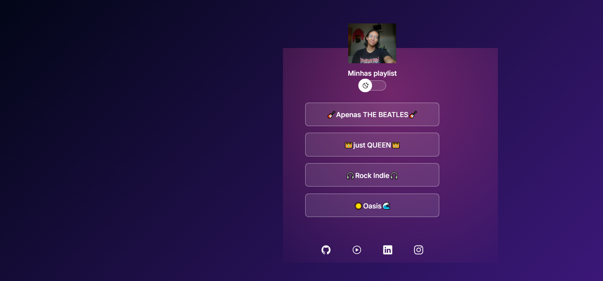

# 🌐 Projeto - Linktree Clone

Este é um projeto simples inspirado no **Linktree**, criado com o objetivo de aprender **HTML, CSS e JavaScript**.  
O projeto possui **tema claro e escuro**, uma foto de perfil personalizada, botões com playlists do Spotify 🎶 e links para minhas redes sociais.

---

## 🚀 Tecnologias utilizadas

- HTML5
- CSS3
- JavaScript (modo claro/escuro)
- [Ionicons](https://ionic.io/ionicons) para ícones
- Figma

---

## 📸 Prévia do Projeto

---

## 🔗 Funcionalidades

- Alternar entre **modo claro e escuro** 🌞🌙
- Acesso rápido às minhas playlists do **Spotify**
- Links para minhas redes sociais: GitHub, LinkedIn, Instagram

---

## 🎶 Minhas playlists

- 🎸 [Apenas THE BEATLES](https://open.spotify.com/playlist/0Cu86jsWCzBOonpbtfrd70?si=60c5ace6354e4b8f)
- 👑 [Just QUEEN](https://open.spotify.com/playlist/5ojYTibrXPc1oqwwvoVkaN?si=71c647d6a26b4166)
- 🎧 [Rock Indie](https://open.spotify.com/playlist/2sPnkJ7k8akUfqk5dE3UTQ?si=2c6275b1c0524018)
- 🌊 [Oasis](https://open.spotify.com/playlist/44rtuTdkCy2K8n9KF9Abtp?si=3306ac78eab643de)

---

## 👤 Autor

Feito por **Bruno Saraiva** ✌️

- [💻 GitHub](https://github.com/Brics-code)
- [🔗 LinkedIn](https://www.linkedin.com/in/bruno-saraiva-118383322/)
- [📷 Instagram](https://www.instagram.com/b.riquess)
- [🎶 Spotify](https://open.spotify.com/user/n5st1kgia1j7exmzze3spn61m?si=e98061c4688a4452)

---
